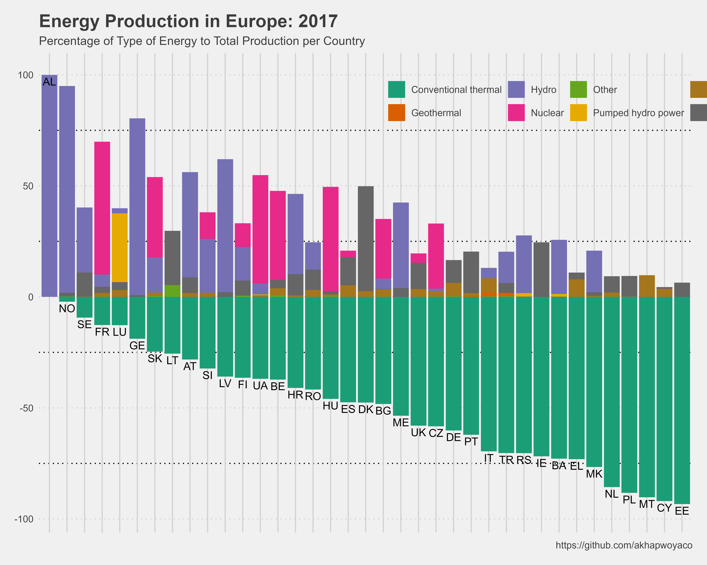

# European energy

The data this week comes from [Eurostat](https://ec.europa.eu/eurostat/statistics-explained/index.php/Electricity_generation_statistics_%E2%80%93_first_results).

H/t to [Karim Douïeb](https://twitter.com/karim_douieb/status/1289530351841234946) who created a very nice graphic in Observable (D3), based off a Washington post article for [US Energy](https://www.washingtonpost.com/climate-environment/2020/07/30/biden-calls-100-percent-clean-electricity-by-2035-heres-how-far-we-have-go/?arc404=true&utm_medium=social&utm_source=twitter&utm_campaign=wp_graphics). Their graphic can be found below.


Additional data can be found via the [OECD](https://data.oecd.org/energy/primary-energy-supply.htm#indicator-chart).

There's also a nice [report](https://ember-climate.org/wp-content/uploads/2018/01/EU-power-sector-report-2017.pdf) for 2017 form the EU Power sector. Lots of graphics inside.

[Thermal power according to Wikipedia](https://en.wikipedia.org/wiki/Thermal_power_station):

> A thermal power station is a power station in which heat energy is converted to electric power. In most, a steam-driven turbine converts heat to mechanical power as an intermediate to electrical power. Water is heated, turns into steam and drives a steam turbine which drives an electrical generator.

Clean vs renewable vs fossil fuels by [Peninsula Energy](https://www.peninsulacleanenergy.com/faq-items/what-is-the-difference-between-clean-and-renewable-energy/).

> Clean energy is carbon-free energy that creates little to no greenhouse gas emissions. This is in contrast to fossil fuels, which produce a significant amount of greenhouse gas emissions, including carbon dioxide and methane. Renewable energy is energy that comes from resources that are naturally replenished such as sunlight, wind, water, and geothermal heat. Unlike fossil fuels, such as oil, natural gas and coal, which cannot be replaced, renewable energy regenerates naturally in a short period of time.

Overall, this dataset was an exploration of pulling data from an Excel-based data product. This was a bit messy to start but applying techniques to extract the data out of repeated tables and into a tidy format is possible programatically with a bit of logic + `readxl`! Check out the cleaning script for the details.

### Get the data here

```{r}
# Get the Data

# Read in with tidytuesdayR package 
# Install from CRAN via: install.packages("tidytuesdayR")
# This loads the readme and all the datasets for the week of interest

# Either ISO-8601 date or year/week works!

tuesdata <- tidytuesdayR::tt_load('2020-08-04')
tuesdata <- tidytuesdayR::tt_load(2020, week = 32)

energy_types <- tuesdata$energy_types

# Or read in the data manually

energy_types <- readr::read_csv('https://raw.githubusercontent.com/rfordatascience/tidytuesday/master/data/2020/2020-08-04/energy_types.csv')
country_totals <- readr::read_csv('https://raw.githubusercontent.com/rfordatascience/tidytuesday/master/data/2020/2020-08-04/country_totals.csv')

```

### Data Dictionary

Limited to Level 1 or 2 production by type - either conventional thermal (fossil fuels), nuclear, hydro, wind, solar, geothermal, or other.

# `energy_types`

| variable | class | description |
|:---|:---|:---|
| country | character | Country ID |
| country_name | character | Country name |
| type | character | Type of energy production |
| level | character | Level - either total, level 1 or level 2. Where level 2 makes up level 1 that makes up the total. |
| 2016 | double | Energy in GWh (Gigawatt hours) |
| 2017 | double | Energy in GWh (Gigawatt hours) |
| 2018 | double | Energy in GWh (Gigawatt hours) |

# `country_totals`

Limited to total net production, along with imports, exports, energy lost, and energy supplied (net + import - export - energy absorbed by pumping).

| variable | class | description |
|:---|:---|:---|
| country | character | Country ID |
| country_name | character | Country name |
| type | character | Type of energy production |
| level | character | Level - either total, level 1 or level 2. Where level 2 makes up level 1 that makes up the total. |
| 2016 | double | Energy in GWh (Gigawatt hours) |
| 2017 | double | Energy in GWh (Gigawatt hours) |
| 2018 | double | Energy in GWh (Gigawatt hours) |

### Cleaning Script

```{r}
library(tidyverse)
library(readxl)
library(countrycode)

raw_code <- countrycode::codelist %>% 
    select(country_name = country.name.en, country = eurostat)

raw_excel <- read_excel("2020/2020-08-04/Electricity_generation_statistics_2019.xlsx", sheet = 3)
  
raw_excel %>% 
    filter(!is.na(...4)) %>% 
    mutate(country = str_remove_all(...4, "[:digit:]"), .before = ...1) %>% 
    mutate(country = if_else(
      str_length(country) > 1, country, NA_character_), 
      country = str_extract(country, "[:alpha:]+")
      ) %>% 
    fill(country) %>% 
  select(-c(...1, ...2, ...14:...18))

row_stat <- read_excel("2020/2020-08-04/Electricity_generation_statistics_2019.xlsx", 
                       sheet = 3,
                       range = "C48:C61", col_names = FALSE)[[1]][c(1,3:14)] %>% 
  str_remove("[:digit:]") %>% 
  str_remove("of which: ") %>% 
  str_remove("\\.") %>% str_trim()

country_range <- tibble(row_start = seq(from = 46, to = 454, by = 34), 
       row_end = seq(from = 61, to = 469, by = 34)) %>% 
  mutate(col1 = 4, col2 = col1 + 5, col3 = col2 + 5) %>% 
  pivot_longer(cols = col1:col3, names_to = "col_var", values_to = "col_start") %>% 
  mutate(col_end = col_start + 2) %>% 
  select(-col_var) %>% 
  slice(-n(), -(n()-1)) %>% 
  mutate(row_stat = list(row_stat))


get_country_stats <- function(row_start, row_end, col_start, col_end, row_stat){
  
  # # pull the row_stat names
  # row_stat <- row_stat

  # create the range programatically
  col_range <- glue::glue("{LETTERS[col_start]}{row_start}:{LETTERS[col_end]}{row_end}")
  
  # read in the data section quietly
  raw_data <- suppressMessages(
    read_excel("2020/2020-08-04/Electricity_generation_statistics_2019.xlsx", 
                         sheet = 3,
                         col_names = FALSE,
                         range = col_range))
  
  
  country_data <-  raw_data %>% 
    # set appropriate names
    set_names(nm = c(2016:2018)) %>% 
    # drop the year ranges
    filter(!is.na(`2016`), `2016` != "2016") %>% 
    # get the country into a column rather than a header
    mutate(country = if_else(
      is.na(`2017`), 
      `2016`, 
      NA_character_), 
      .before = `2016`) %>% 
    # fill country down
    fill(country) %>% 
    # drop old country header
    filter(!is.na(`2017`)) %>% 
    # add row stat in
    mutate(type = row_stat, 
           .after = country, 
           # add levels of the stats
           level = c("Total", "Level 1", "Level 1", "Level 1", "Level 2", 
                     "Level 1", "Level 1", "Level 1", "Level 1", "Total", 
                     "Total", "Total", "Total")) %>% 
    # format as double
    mutate(across(c(`2016`:`2018`), as.double))
  
  # return data
  country_data
}

all_countries <- country_range %>% 
  pmap_dfr(get_country_stats) %>% 
  left_join(raw_code, by = "country") %>% 
  select(country, country_name, everything())

country_totals <- all_countries %>% 
  filter(level == "Total")

country_production <- all_countries %>% 
  filter(level != "Total")

# sanity check
country_totals %>% 
  # filter(type == "Total net production") %>% 
  pivot_longer(cols = `2016`:`2018`, names_to = "year", values_to = "value") %>% 
  filter(type == "Total net production") %>%
  # count(type)%>% 
  ggplot(aes(y = value, x = year, color = country, group = country)) +
  geom_line()

write_csv(country_totals, "2020/2020-08-04/country_totals.csv")

write_csv(country_production, "2020/2020-08-04/energy_types.csv")

```

## plot


