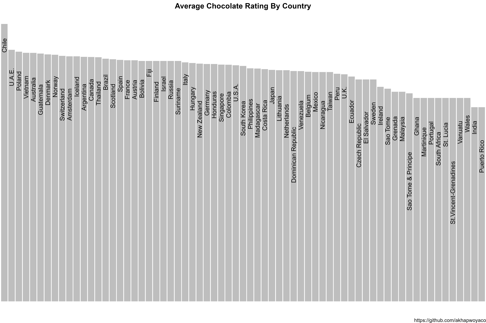

# Chocolate Ratings

The data this week comes from [Flavors of Cacao](http://flavorsofcacao.com/chocolate_database.html) by way of [Georgios and Kelsey](https://github.com/rfordatascience/tidytuesday/issues/408).

Some analysis from 2017 on this data at [Kaggle](https://www.kaggle.com/willcanniford/chocolate-bar-ratings-extensive-eda).

### Get the data here

```{r}
# Get the Data

# Read in with tidytuesdayR package 
# Install from CRAN via: install.packages("tidytuesdayR")
# This loads the readme and all the datasets for the week of interest

# Either ISO-8601 date or year/week works!

tuesdata <- tidytuesdayR::tt_load('2022-01-18')
tuesdata <- tidytuesdayR::tt_load(2022, week = 3)

chocolate <- tuesdata$chocolate

# Or read in the data manually

chocolate <- readr::read_csv('https://raw.githubusercontent.com/rfordatascience/tidytuesday/master/data/2022/2022-01-18/chocolate.csv')

```

### Data Dictionary

# `chocolate.csv`

| variable | class | description |
|:------------------------------------|:-----------------|:-----------------|
| ref | integer | Reference ID, The highest REF numbers were the last entries made. |
| company_manufacturer | character | Manufacturer name |
| company_location | character | Manufacturer region |
| review_date | integer | Review date (year) |
| country_of_bean_origin | character | Country of origin |
| specific_bean_origin_or_bar_name | character | Specific bean or bar name |
| cocoa_percent | character | Cocoa percent (% chocolate) |
| ingredients | character | Ingredients, ("\#" = represents the number of ingredients in the chocolate; B = Beans, S = Sugar, S\* = Sweetener other than white cane or beet sugar, C = Cocoa Butter, V = Vanilla, L = Lecithin, Sa = Salt) |
| most_memorable_characteristics | character | Most Memorable Characteristics column is a summary review of the most memorable characteristics of that bar. Terms generally relate to anything from texture, flavor, overall opinion, etc. separated by ',' |
| rating | double | rating between 1-5 |

# Visualization


