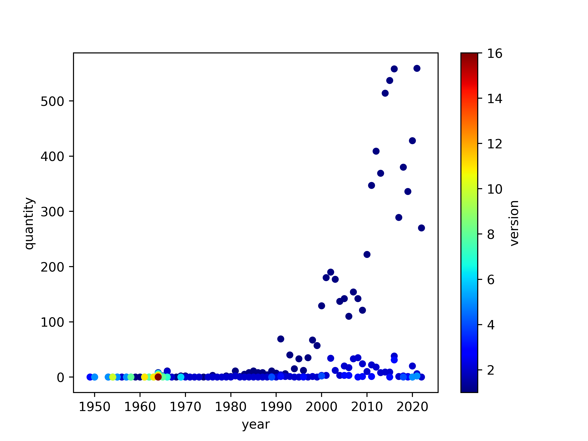

### Please add alt text to your posts

Please add alt text (alternative text) to all of your posted graphics for `#TidyTuesday`.

Twitter provides [guidelines](https://help.twitter.com/en/using-twitter/picture-descriptions) for how to add alt text to your images.

# LEGO sets

The data this week comes from [rebrickable](https://rebrickable.com/downloads/) courtesy of [Georgios Karamanis](https://github.com/rfordatascience/tidytuesday/issues/455).

> The LEGO Parts/Sets/Colors and Inventories of every official LEGO set in the Rebrickable database is available for download as csv files here. These files are automatically updated daily. If you need more details, you can use the API which provides real-time data, but has rate limits that prevent bulk downloading of data.

### Get the data here

```{r}
# Get the Data

# Read in with tidytuesdayR package 
# Install from CRAN via: install.packages("tidytuesdayR")
# This loads the readme and all the datasets for the week of interest

# Either ISO-8601 date or year/week works!

tuesdata <- tidytuesdayR::tt_load('2022-09-06')
tuesdata <- tidytuesdayR::tt_load(2022, week = 36)

inventories <- tuesdata$inventories

# Or read in the data manually

inventories <- readr::read_csv('https://raw.githubusercontent.com/rfordatascience/tidytuesday/master/data/2022/2022-09-06/inventories.csv.gz')
inventory_sets <- readr::read_csv('https://raw.githubusercontent.com/rfordatascience/tidytuesday/master/data/2022/2022-09-06/inventory_sets.csv.gz')
sets <- readr::read_csv('https://raw.githubusercontent.com/rfordatascience/tidytuesday/master/data/2022/2022-09-06/sets.csv.gz')

```

### Data Dictionary

# `inventories.csv.gz`

| variable | class     | description |
|:---------|:----------|:------------|
| id       | double    | variable    |
| version  | double    | variable    |
| set_num  | character | variable    |

# `inventory_sets.csv.gz`

| variable     | class     | description |
|:-------------|:----------|:------------|
| inventory_id | double    | variable    |
| set_num      | character | variable    |
| quantity     | double    | variable    |

# `sets.csv.gz`

| variable  | class     | description |
|:----------|:----------|:------------|
| set_num   | character | variable    |
| name      | character | variable    |
| year      | double    | variable    |
| theme_id  | double    | variable    |
| num_parts | double    | variable    |
| img_url   | character | variable    |

### Cleaning Script

``` r
library(tidyverse)

all_csvs <- list.files("2022/2022-09-06") |> 
  stringr::str_subset(".csv")
  
all_csvs

inventories <- read_csv("2022/2022-09-06/inventories.csv.gz")
inventory_sets <- read_csv("2022/2022-09-06/inventory_sets.csv.gz")
sets <- read_csv("2022/2022-09-06/sets.csv.gz")

all_df <- left_join(inventories, inventory_sets, by = "set_num") |>
  left_join(sets, by = "set_num") 

ex_plot <- all_df |> 
  ggplot(aes(x = num_parts)) +
  geom_density() +
  scale_x_log10()

ggsave("2022/2022-09-06/pic2.png", ex_plot, dpi = "retina", height = 4, width = 6)
```

 
