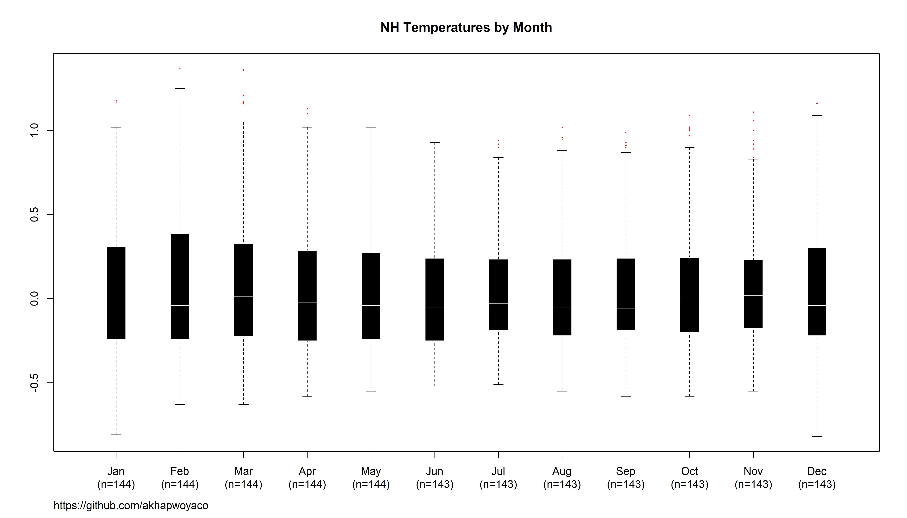
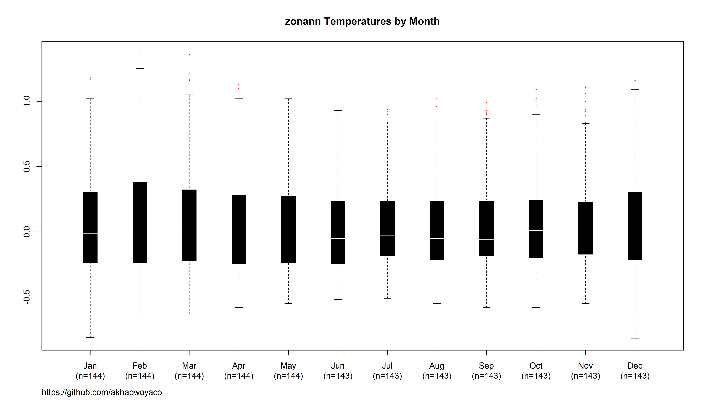

# Global surface temperatures

The data this week comes from the [NASA GISS Surface Temperature Analysis (GISTEMP v4)](https://data.giss.nasa.gov/gistemp/). This datasets are tables of global and hemispheric monthly means and zonal annual means. They combine land-surface, air and sea-surface water temperature anomalies (Land-Ocean Temperature Index, L-OTI). The values in the tables are deviations from the corresponding 1951-1980 means.

> The GISS Surface Temperature Analysis version 4 (GISTEMP v4) is an estimate of global surface temperature change. Graphs and tables are updated around the middle of every month using current data files from NOAA GHCN v4 (meteorological stations) and ERSST v5 (ocean areas), combined as described in their publications Hansen et al. (2010) and Lenssen et al. (2019). These updated files incorporate reports for the previous month and also late reports and corrections for earlier months.

> When comparing seasonal temperatures, it is convenient to use “meteorological seasons” based on temperature and defined as groupings of whole months. Thus, Dec-Jan-Feb (DJF) is the Northern Hemisphere meteorological winter, Mar-Apr-May (MAM) is N.H. meteorological spring, Jun-Jul-Aug (JJA) is N.H. meteorological summer and Sep-Oct-Nov (SON) is N.H. meteorological autumn. String these four seasons together and you have the meteorological year that begins on Dec. 1 and ends on Nov. 30 (D-N). The full year is Jan to Dec (J-D). [Brian Bartling](https://rpubs.com/BrianBartling/GISTEMP)

An analysis and more information on the data can be found in Lenssen, N., G. Schmidt, J. Hansen, M. Menne, A. Persin, R. Ruedy, and D. Zyss, 2019: Improvements in the GISTEMP uncertainty model. J. Geophys. Res. Atmos., 124, no. 12, 6307-6326, <doi:10.1029/2018JD029522>.

There's also more detail and answers to commonly asked in questions in [their FAQ](https://data.giss.nasa.gov/gistemp/faq/).

Citation: GISTEMP Team, 2023: GISS Surface Temperature Analysis (GISTEMP), version 4. NASA Goddard Institute for Space Studies. Dataset accessed 2023-07-09 at <https://data.giss.nasa.gov/gistemp/>.

### Get the data here

```{r}
# Get the Data

# Read in with tidytuesdayR package 
# Install from CRAN via: install.packages("tidytuesdayR")
# This loads the readme and all the datasets for the week of interest

# Either ISO-8601 date or year/week works!

tuesdata <- tidytuesdayR::tt_load('2023-07-11')
tuesdata <- tidytuesdayR::tt_load(2023, week = 28)

global_temps <- tuesdata$global_temps
nh_temps <- tuesdata$nh_temps
sh_temps <- tuesdata$sh_temps
zonann_temps <- tuesdata$zonann_temps

# Or read in the data manually

global_temps <- readr::read_csv('https://raw.githubusercontent.com/rfordatascience/tidytuesday/master/data/2023/2023-07-11/global_temps.csv')
nh_temps <- readr::read_csv('https://raw.githubusercontent.com/rfordatascience/tidytuesday/master/data/2023/2023-07-11/nh_temps.csv')
sh_temps <- readr::read_csv('https://raw.githubusercontent.com/rfordatascience/tidytuesday/master/data/2023/2023-07-11/sh_temps.csv')
zonann_temps <- readr::read_csv('https://raw.githubusercontent.com/rfordatascience/tidytuesday/master/data/2023/2023-07-11/zonann_temps.csv')

```

### Data Dictionary

# `global_temps.csv`

| variable | class  | description                |
|:---------|:-------|:---------------------------|
| Year     | double | Year                       |
| Jan      | double | January                    |
| Feb      | double | February                   |
| Mar      | double | March                      |
| Apr      | double | April                      |
| May      | double | May                        |
| Jun      | double | June                       |
| Jul      | double | July                       |
| Aug      | double | August                     |
| Sep      | double | September                  |
| Oct      | double | October                    |
| Nov      | double | November                   |
| Dec      | double | December                   |
| J-D      | double | January-December           |
| D-N      | double | Decemeber-November         |
| DJF      | double | December-January-February  |
| MAM      | double | March-April-May            |
| JJA      | double | June-July-August           |
| SON      | double | September-October-November |

# `nh_temps.csv`

| variable | class  | description                |
|:---------|:-------|:---------------------------|
| Year     | double | Year                       |
| Jan      | double | January                    |
| Feb      | double | February                   |
| Mar      | double | March                      |
| Apr      | double | April                      |
| May      | double | May                        |
| Jun      | double | June                       |
| Jul      | double | July                       |
| Aug      | double | August                     |
| Sep      | double | September                  |
| Oct      | double | October                    |
| Nov      | double | November                   |
| Dec      | double | December                   |
| J-D      | double | January-December           |
| D-N      | double | Decemeber-November         |
| DJF      | double | December-January-February  |
| MAM      | double | March-April-May            |
| JJA      | double | June-July-August           |
| SON      | double | September-October-November |

# `sh_temps.csv`

| variable | class  | description                |
|:---------|:-------|:---------------------------|
| Year     | double | Year                       |
| Jan      | double | January                    |
| Feb      | double | February                   |
| Mar      | double | March                      |
| Apr      | double | April                      |
| May      | double | May                        |
| Jun      | double | June                       |
| Jul      | double | July                       |
| Aug      | double | August                     |
| Sep      | double | September                  |
| Oct      | double | October                    |
| Nov      | double | November                   |
| Dec      | double | December                   |
| J-D      | double | January-December           |
| D-N      | double | Decemeber-November         |
| DJF      | double | December-January-February  |
| MAM      | double | March-April-May            |
| JJA      | double | June-July-August           |
| SON      | double | September-October-November |

# `zonann_temps.csv`

| variable | class  | description         |
|:---------|:-------|:--------------------|
| Year     | double | Year                |
| Glob     | double | Global              |
| NHem     | double | Northern Hemisphere |
| SHem     | double | Southern Hemisphere |
| 24N-90N  | double | 24N-90N lattitude   |
| 24S-24N  | double | 24S-24N lattitude   |
| 90S-24S  | double | 90S-24S lattitude   |
| 64N-90N  | double | 64N-90N lattitude   |
| 44N-64N  | double | 44N-64N lattitude   |
| 24N-44N  | double | 24N-44N lattitude   |
| EQU-24N  | double | EQU-24N lattitude   |
| 24S-EQU  | double | 24S-EQU lattitude   |
| 44S-24S  | double | 44S-24S lattitude   |
| 64S-44S  | double | 64S-44S lattitude   |
| 90S-64S  | double | 90S-64S lattitude   |

### Data Visualization

   
