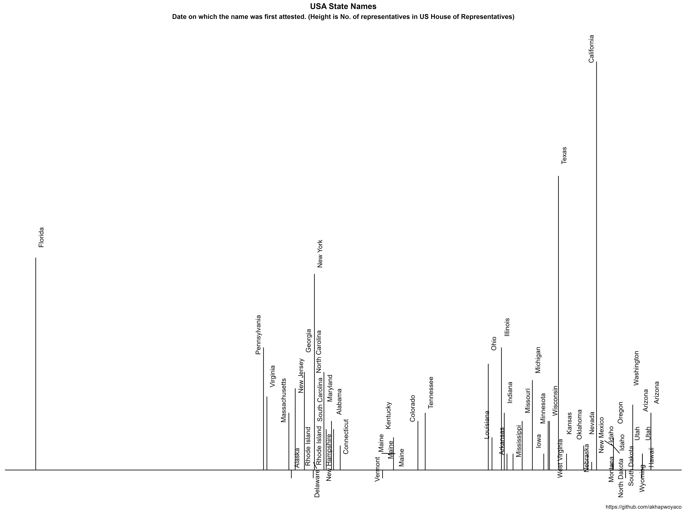
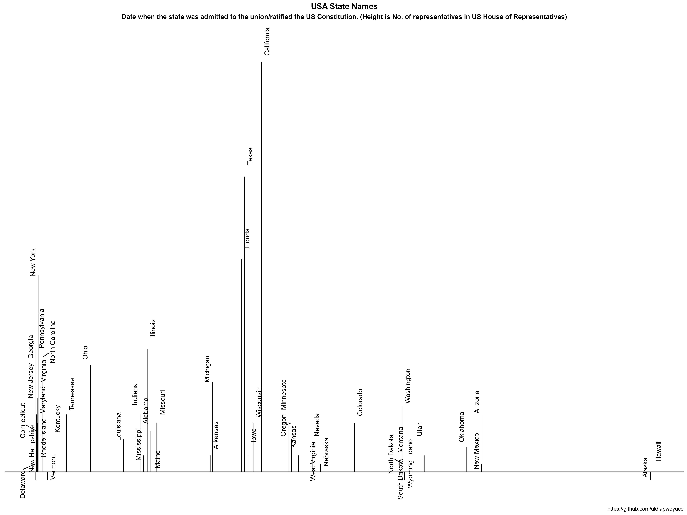

# US State Names

Happy [Colorado Day](https://www.timeanddate.com/holidays/us/colorado-day)! The data this week comes from three Wikipedia articles: [List of states and territories of the United States](https://en.wikipedia.org/wiki/List_of_states_and_territories_of_the_United_States), [List of demonyms for US states and territories](https://en.wikipedia.org/wiki/List_of_demonyms_for_US_states_and_territories), and [List of state and territory name etymologies of the United States](https://en.wikipedia.org/wiki/List_of_state_and_territory_name_etymologies_of_the_United_States).

A number of past TidyTuesdays (such as [2018/2018-04-03](https://tidytues.day/2018/2018-04-03), [2019/2019-01-29](https://tidytues.day/2019/2019-01-29), [2020/2020-03-10](https://tidytues.day/2020/2020-03-10), and [2022/2022-11-08](https://tidytues.day/2022/2022-11-08) have state columns. Might joining in this state date offer any insights to those datasets?

## The Data

```{r}
# Option 1: tidytuesdayR package 
## install.packages("tidytuesdayR")

tuesdata <- tidytuesdayR::tt_load('2023-08-01')
## OR
tuesdata <- tidytuesdayR::tt_load(2023, week = 31)

states <- tuesdata$states
state_name_etymology <- tuesdata$state_name_etymology

# Option 2: Read directly from GitHub

states <- readr::read_csv('https://raw.githubusercontent.com/rfordatascience/tidytuesday/master/data/2023/2023-08-01/states.csv')
state_name_etymology <- readr::read_csv('https://raw.githubusercontent.com/rfordatascience/tidytuesday/master/data/2023/2023-08-01/state_name_etymology.csv')
```

### Data Dictionary

# `states.csv`

| variable | class | description |
|:--------------------------|:-----------------|:--------------------------|
| state | character | The name of the state. The Wikipedia article has footnotes pointing out that Kentucky, Massachusetts, Pennsylvania, and Virginia are officially "commonwealths" in their full official names, not states. |
| postal_abbreviation | character | The 2-letter postal abbreviation. |
| capital_city | character | The capital of the state. |
| largest_city | character | The largest city in the state as of 2020. |
| admission | date | The date when the state was admitted to the union, or when it ratified the US Constitution. |
| population_2020 | integer | The population as of the 2020 census. |
| total_area_mi2 | integer | The total area of the state in square miles. |
| total_area_km2 | integer | The total area of the state in square kilometers. |
| land_area_mi2 | integer | The area of the state that is on land in square miles. |
| land_area_km2 | integer | The area of the state that is on land in square kilometers. |
| water_area_mi2 | integer | The area of the state occupied by water in square miles. |
| water_area_km2 | integer | The area of the state occupied by water in square kilometers. |
| n_representatives | integer | The number of representatives the state has in the US House of Representatives. |
| demonym | character | The official name of a resident of the state. |

# `state_name_etymology.csv`

| variable | class | description |
|:--------------------------|:-----------------|:--------------------------|
| state | character | The name of the state. |
| date_named | date | The date on which the name (or a version of the name that led to the modern version) was first attested. Note: Colorado is shown as occurring on January 1, but only the year is known. |
| language | character | The language from which the state name is believed to have been derived. Note that some states have more than one entry, in more than one row! |
| words_in_original | character | The word or words in the original language that became the state name. This field has footnotes in the original Wikipedia article. |
| meaning | character | The meaning of the original words. This field has footnotes in the original Wikipedia article. |

### Cleaning Script

``` r
library(rvest)
library(tidyverse)
library(here)

# Load basic state data from Wikipedia.
states <- read_html("https://en.wikipedia.org/wiki/List_of_states_and_territories_of_the_United_States") |> 
  html_table(header = TRUE) |> 
  # Try out the new-ish use of _ for subsetting with the base pipe.
  _[[2]][-1,]
colnames(states) <- c(
  "state",
  "postal_abbreviation",
  "capital_city",
  "largest_city",
  "admission",
  "population_2020",
  "total_area_mi2",
  "total_area_km2",
  "land_area_mi2",
  "land_area_km2",
  "water_area_mi2",
  "water_area_km2",
  "n_representatives"
)
glimpse(states)

# Clean types.
states <- states |> 
  mutate(
    across(
      c(population_2020, contains("area"), n_representatives),
      ~ parse_number(.x) |> as.integer()
    ),
    admission = parse_date(admission, format = "%b %d, %Y"),
    state = str_remove(state, fixed("[B]"))
  )

state_demonyms <- read_html("https://en.wikipedia.org/wiki/List_of_demonyms_for_US_states_and_territories") |> 
  html_table() |> 
  _[[1]][-1,1:2]
colnames(state_demonyms) <- c("state", "demonym")
states <- states |> 
  left_join(state_demonyms, by = "state")

# Confirm that the join worked!

states |> 
  filter(is.na(demonym))

state_name_etymology <- read_html("https://en.wikipedia.org/wiki/List_of_state_and_territory_name_etymologies_of_the_United_States") |> 
  html_table() |> 
  _[[1]]
colnames(state_name_etymology) <- c(
  "state",
  "date_named",
  "language",
  "words_in_original",
  "meaning"
)
state_name_etymology <- state_name_etymology |>
  mutate(
    date_named = if_else(
      date_named == "1743",
      "January 1, 1743",
      date_named
    ) |> 
      parse_date(format = "%B %d, %Y"),
    # We remove footnotes, but will reference them in the dictionary.
    across(
      c(words_in_original, meaning),
      ~ str_remove_all(.x, "\\[\\d+\\]")
    )
  )

# Confirm that the tables match up.
states |> 
  full_join(state_name_etymology, by = "state") |> 
  filter(is.na(date_named))
states |> 
  full_join(state_name_etymology, by = "state") |> 
  filter(is.na(admission))

write_csv(
  states,
  here(
    "data",
    "2023",
    "2023-08-01",
    "states.csv"
  )
)
write_csv(
  state_name_etymology,
  here(
    "data",
    "2023",
    "2023-08-01",
    "state_name_etymology.csv"
  )
)
```

## Visualization




