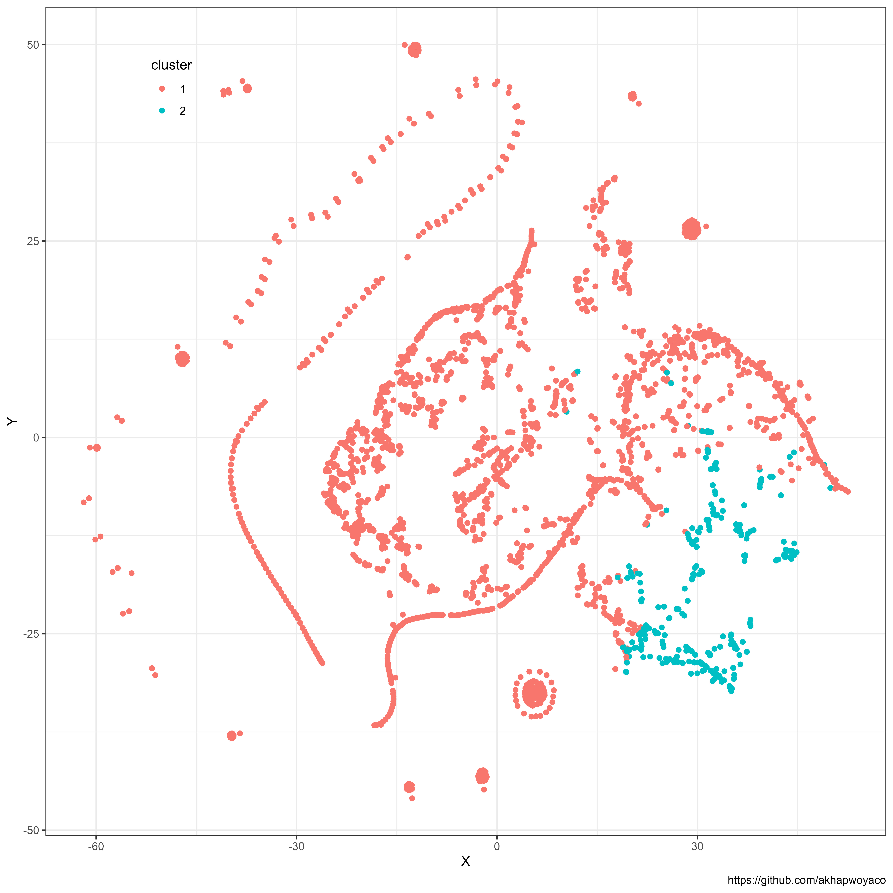
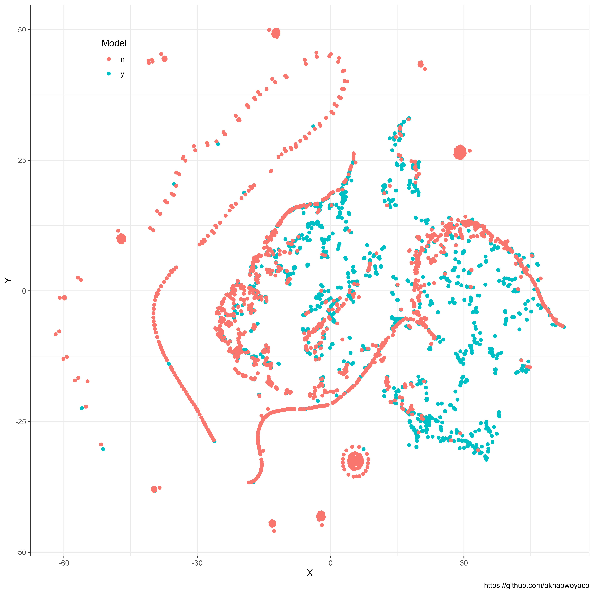

# Spam E-mail

The data this week comes from Vincent Arel-Bundock's Rdatasets package(https://vincentarelbundock.github.io/Rdatasets/index.html). 

> Rdatasets is a collection of 2246 datasets which were originally distributed alongside the statistical software environment R and some of its add-on packages. The goal is to make these data more broadly accessible for teaching and statistical software development.

We're working with the [spam email](https://vincentarelbundock.github.io/Rdatasets/doc/DAAG/spam7.html) dataset. This is a subset of the [spam e-mail database](https://search.r-project.org/CRAN/refmans/kernlab/html/spam.html).

This is a dataset collected at Hewlett-Packard Labs by Mark Hopkins, Erik Reeber, George Forman, and Jaap Suermondt and shared with the [UCI Machine Learning Repository](https://archive.ics.uci.edu/dataset/94/spambase). The dataset classifies 4601 e-mails as spam or non-spam, with additional variables indicating the frequency of certain words and characters in the e-mail.


## The Data

```{r}
# Option 1: tidytuesdayR package 
## install.packages("tidytuesdayR")

tuesdata <- tidytuesdayR::tt_load('2023-08-15')
## OR
tuesdata <- tidytuesdayR::tt_load(2023, week = 33)

spam <- tuesdata$spam

# Option 2: Read directly from GitHub

spam <- readr::read_csv('https://raw.githubusercontent.com/rfordatascience/tidytuesday/master/data/2023/2023-08-15/spam.csv')
```

### Data Dictionary

# `spam.csv`

|variable |class     |description |
|:--------|:---------|:-----------|
|crl.tot  |double    | Total length of uninterrupted sequences of capitals     |
|dollar   |double    | Occurrences of the dollar sign, as percent of total number of characters     |
|bang     |double    | Occurrences of ‘!’, as percent of total number of characters    |
|money    |double    | Occurrences of ‘money’, as percent of total number of characters    |
|n000     |double    | Occurrences of the string ‘000’, as percent of total number of words    |
|make     |double    | Occurrences of ‘make’, as a percent of total number of words       |
|yesno    |character | Outcome variable, a factor with levels 'n' not spam, 'y' spam |

### Cluster Analysis and Data Viz


