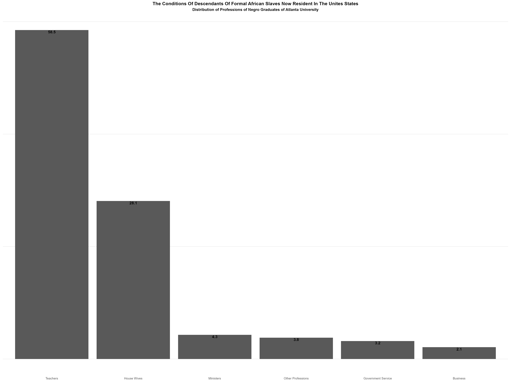

# Du Bois Visualization Challenge 2024

This week we're inviting you to participate in the [2024 Du Bois Visualization Challenge](https://github.com/ajstarks/dubois-data-portraits/blob/master/challenge/2024/README.md).

## The Data

```{r}
# Option 1: tidytuesdayR package 
## install.packages("tidytuesdayR")

tuesdata <- tidytuesdayR::tt_load('2024-04-02')
## OR
tuesdata <- tidytuesdayR::tt_load(2024, week = 14)

dubois_week10 <- tuesdata$dubois_week10

# Option 2: Read directly from GitHub

dubois_week10 <- readr::read_csv('https://raw.githubusercontent.com/rfordatascience/tidytuesday/master/data/2024/2024-04-02/dubois_week10.csv')

```

### Data Dictionary

# `dubois_week10.csv`

| variable | class | description |
|:---|:---|:---|
| Occupation | character | Occupations of the 330 "negro" graduates of Atlanta University as of 1900. |
| Percentage | double | Percentage of graduates with this occupation. |

### 

 
