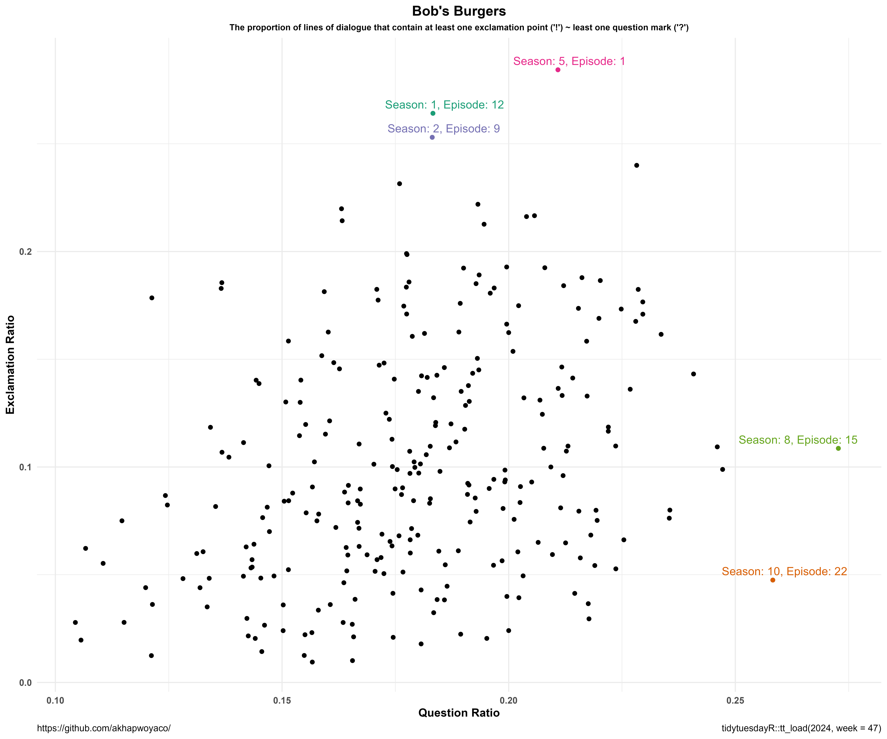

# Bob's Burgers Episodes

This week we're exploring Bob's Burgers dialogue! Thank you to [Steven Ponce](https://github.com/poncest) for [the data](https://github.com/poncest/bobsburgersR), and a [blog post demonstrating how to visualize the data](https://stevenponce.netlify.app/projects/standalone_visualizations/sa_2024-11-11.html)!

See the [{bobsburgersR} R Package](https://github.com/poncest/bobsburgersR) for the original transcript data, as well as additional information about each episode!

-   How have dialogue metrics changed over the seasons?
-   Can you find any patterns not shown in Steven Ponce's original visualization?

Thank you to [Jon Harmon](https://github.com/jonthegeek) for curating this week's dataset.

## The Data

``` r
# Option 1: tidytuesdayR package 
## install.packages("tidytuesdayR")

tuesdata <- tidytuesdayR::tt_load('2024-11-19')
## OR
tuesdata <- tidytuesdayR::tt_load(2024, week = 47)

episode_metrics <- tuesdata$episode_metrics

# Option 2: Read directly from GitHub

episode_metrics <- readr::read_csv('https://raw.githubusercontent.com/rfordatascience/tidytuesday/main/data/2024/2024-11-19/episode_metrics.csv')
```

### Data Dictionary

# `episode_metrics.csv`

| variable | class | description |
|:-----------------|:---------------|:-------------------------------------|
| season | integer | The season number in which the episode is part of the Bob's Burgers TV show. |
| episode | integer | The episode number within the specific season of Bob's Burgers. |
| dialogue_density | double | The number of non-blank lines in this episode. |
| avg_length | double | The average number of characters (technically codepoints, see `?stringr::str_length`) per line of dialogue. |
| sentiment_variance | double | The variance in the numeric AFINN sentiment of words in this episode. See `?textdata::lexicon_afinn` for further information. |
| unique_words | integer | The number of unique lowercase words in this episode. |
| question_ratio | double | The proportion of lines of dialogue that contain at least one question mark ("?"). |
| exclamation_ratio | double | The proportion of lines of dialogue that contain at least one exclamation point ("!"). |

### EDA



### Cleaning Script

``` r
# Mostly clean data provided by Steven Ponce (@poncest) via the {bobsburgersR} R
# package. Cleaning based on
# https://stevenponce.netlify.app/projects/standalone_visualizations/sa_2024-11-11.html

# pak::pak("poncest/bobsburgersR")
# pak::pak("tidytext")
# pak::pak("textdata")
library(bobsburgersR)
library(tidyverse)
library(tidytext)

transcript_data <- 
  bobsburgersR::transcript_data |> 
  dplyr::mutate(
    dplyr::across(
      c(season, episode),
      as.integer
    )
  )

# Calculate metrics. You will have to acknowledge downloading of afinn data if
# you have not used it before.
episode_metrics <-
  transcript_data |>
  dplyr::filter(!is.na(dialogue)) |>
  dplyr::summarize(
    # Basic dialogue metrics
    dialogue_density = dplyr::n() / max(line),
    avg_length       = mean(stringr::str_length(dialogue)),
    
    # Sentiment analysis - AFINN Sentiment Lexicon
    sentiment_variance = dialogue |>
      tibble::tibble(text = _) |>
      tidytext::unnest_tokens(word, text) |>
      dplyr::inner_join(tidytext::get_sentiments("afinn"), by = "word") |>
      dplyr::pull(value) |>
      var(na.rm = TRUE),
    
    # Word and punctuation metrics  
    unique_words      = dialogue |>
      # Using boundary() instead of "\\s+" as in the blog results in differences
      # in unique word counts, since punctuation doesn't get grouped with the
      # word it touches. See ?stringr::boundary for details. I also converted
      # all text to lowercase before counting.
      stringr::str_split(stringr::boundary("word")) |>
      unlist() |>
      tolower() |> 
      dplyr::n_distinct(),
    question_ratio    = mean(stringr::str_detect(dialogue, "\\?")),
    exclamation_ratio = mean(stringr::str_detect(dialogue, "!")),
    .by = c(season, episode)
  )

# You may wish to see the blog post for further preparation steps!
```
