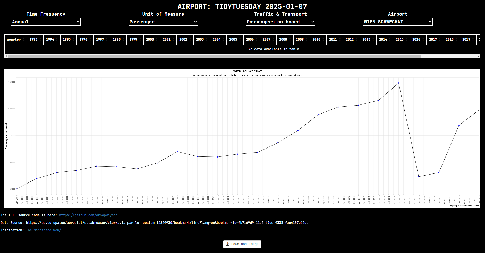

# Air passenger transport routes between partner airports and main airports in Luxembourg

## The Data

``` r
https://ec.europa.eu/eurostat/databrowser/view/avia_par_lu__custom_14829930/bookmark/line?lang=en&bookmarkId=fb7169d9-11d5-47de-9335-fa64107e66ea
```

### Data Dictionary

# `Sheet 1:`

| variable | class | description |
|:--------------|:--------------|:------------------------------------------|
| Airport Labels | character | Name of airports in Luxembourg. |
| Time in yyyy-quarter | numeric | Passengers on board, airports in Luxembourg per yyyyy-quarter. |

### Cleaning Script

``` r
library(tidyverse)
library(dplyr)
library(readxl)
library(janitor)
avia_par_lu_spreadsheet <- read_excel(
  path = "avia_par_lu_spreadsheet.xlsx", 
  sheet = "Sheet 1", skip = 8, na = c(":", "not available" )) |>
  # exclude columns with entirely missing data
  janitor::remove_empty(which = "cols") |>
  drop_na(TIME) |> slice(-1) |> # remove that first row
  filter(!grepl("Special value", TIME))
```

## SHINY APP


